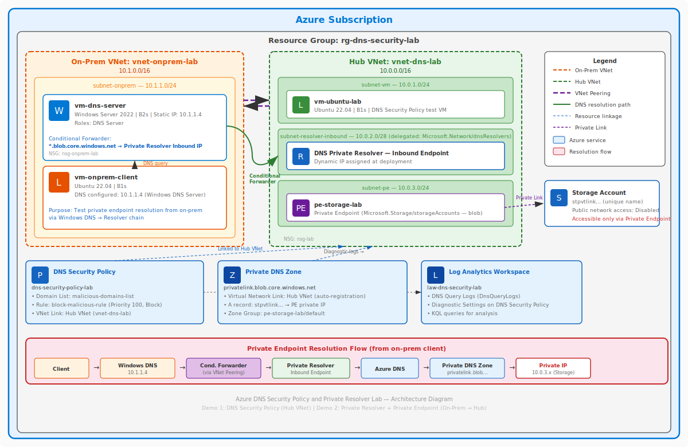

# Azure DNS Security Policy & Private Resolver Lab

A complete lab environment for testing and learning Azure DNS Security Policies and Azure DNS Private Resolver with simulated on-premises connectivity. This lab demonstrates how to deploy and configure DNS security policies to block malicious domains, and how to use a Private Resolver with on-premises DNS forwarding to resolve private endpoints — all using Azure CLI automation in GitHub Codespaces.

## Lab Overview

This lab creates a complete Azure environment with two demos:

### Demo 1: DNS Security Policy
- **Virtual Network** with an Ubuntu 22.04 LTS virtual machine (no public IP - serial console access)
- **Azure DNS Security Policy** linked to the virtual network
- **DNS Domain List** with malicious domains (`malicious.contoso.com.`, `exploit.adatum.com.`)
- **DNS Security Rules** to block specific domains with blockpolicy.azuredns.invalid response
- **Network Security Group** for internal access only
- **Log Analytics Workspace** for DNS query monitoring and diagnostics
- **Diagnostic Settings** configured to capture all DNS security events

### Demo 2: Private Resolver & On-Premises DNS Forwarding
- **Azure DNS Private Resolver** with inbound endpoint in the hub VNet
- **Simulated on-premises environment** with a separate VNet (peered to hub)
- **Windows Server 2022** with DNS Server role and conditional forwarder to the Private Resolver
- **Ubuntu client VM** in the on-prem network using the Windows DNS Server
- **Storage account** with public access disabled and a private endpoint
- **Private DNS Zone** (`privatelink.blob.core.windows.net`) linked to the hub VNet
- **VNet peering** connecting the on-prem and hub networks

## Architecture



> The source diagram is also available as [architecture.drawio](architecture.drawio) for editing with the [Draw.io VS Code extension](https://marketplace.visualstudio.com/items?itemName=hediet.vscode-drawio).

## Prerequisites

**NONE!** This lab is designed to run in GitHub Codespaces with no additional setup required.

The Codespaces devcontainer includes:
- Azure CLI (latest version)
- jq JSON processor
- All required VS Code extensions

## Quick Start

### 1. Open in Codespaces

Click the "Code" button and select "Open with Codespaces" to launch the lab environment.

### 2. Configure Your Subscription

Edit the `answers.json` file and add your Azure subscription ID:

```json
{
  "subscriptionId": "YOUR-SUBSCRIPTION-ID-HERE"
}
```

### 3. Deploy the Lab

Run the deployment script:

```bash
./deploy-lab.sh
```

> **Note**: If you get "Permission denied", run `chmod +x *.sh` first, or use `bash deploy-lab.sh`

The script will:
- Prompt for Azure authentication via device code
- Request a secure password for all VMs (Ubuntu, Windows DNS Server, on-prem client)
- Deploy all Azure resources (DNS Security Policy, Private Resolver, on-prem VMs, storage + PE)
- Configure DNS security policies and monitoring
- Configure Windows DNS Server with conditional forwarder
- Set up VNet peering and private endpoint

### 4. Test DNS Security Policy (Demo 1)

After deployment, access the Ubuntu VM via the Azure Portal:

1. Go to [Azure Portal](https://portal.azure.com)
2. Navigate to Virtual Machines
3. Select `vm-ubuntu-lab` in the resource group
4. Click "Serial console" in the left menu
5. Login with the credentials you provided

Test DNS blocking from the VM:
```bash
# Test blocked domains (should return blockpolicy.azuredns.invalid)
dig malicious.contoso.com
dig exploit.adatum.com

# Test allowed domains (should resolve normally)
dig google.com
dig microsoft.com

# For more detailed output, use:
dig malicious.contoso.com +short
dig @8.8.8.8 google.com  # Test with external DNS for comparison
```

**Expected Results:**
- **Blocked domains**: Should return `blockpolicy.azuredns.invalid`
- **Allowed domains**: Should return IP addresses normally

### 5. Test Private Resolver & On-Prem DNS (Demo 2)

Access the on-prem client VM via the Azure Portal:

1. Navigate to Virtual Machines
2. Select `vm-onprem-client` in the resource group
3. Click "Serial console" → Login with the same credentials

Test private endpoint resolution from the on-prem client:
```bash
# Find your storage account name from the deployment output, then:
nslookup <storage-account-name>.blob.core.windows.net

# Should return a PRIVATE IP (10.0.3.x), NOT a public IP
# Resolution path: Client -> Windows DNS (10.1.1.4) -> Private Resolver -> Private DNS Zone
```

**(Optional) Verify Windows DNS Server configuration:**

1. Navigate to Virtual Machines → `vm-dns-server`
2. Click "Serial console"
3. At the SAC prompt, type `cmd` then `ch -si 1`
4. Login with the same credentials

```powershell
# Check conditional forwarders
powershell -Command "Get-DnsServerZone | Where-Object ZoneType -eq 'Forwarder'"
# Should show blob.core.windows.net forwarding to the resolver inbound IP

# Check DNS server forwarders
powershell -Command "Get-DnsServerForwarder"
```

### 6. Monitor DNS Activity

View DNS logs in Log Analytics:
1. Go to your resource group in Azure Portal
2. Open the Log Analytics workspace (`law-dns-security-lab`)
3. Click "Logs" and run KQL queries

### 7. Clean Up

When finished:
```bash
./remove-lab.sh
```

## DNS Query Monitoring

The lab includes a Log Analytics workspace that automatically collects DNS query logs from the DNS Security Policy. This provides visibility into:

- **All DNS queries** passing through the security policy
- **Blocked queries** and the domains that triggered blocks
- **Query patterns** and frequency analysis
- **Security events** for monitoring malicious activity

### Accessing DNS Logs

1. Navigate to your DNS security policy in the Azure Portal
2. Under **Monitoring**, select **Diagnostic settings**
3. Select your Log Analytics workspace (`law-dns-security-lab`)
4. Click **Logs** to open the query interface

### Sample KQL Queries

Based on the official [DNSQueryLogs table schema](https://learn.microsoft.com/en-us/azure/azure-monitor/reference/tables/dnsquerylogs), here are accurate queries for analyzing DNS security events:

```kusto
// View all DNS queries from the last hour
DNSQueryLogs
| where TimeGenerated > ago(1h)
| project TimeGenerated, QueryName, SourceIpAddress, ResponseCode, ResolverPolicyRuleAction
| order by TimeGenerated desc

// View blocked DNS queries only
DNSQueryLogs
| where ResolverPolicyRuleAction == "Deny"
| project TimeGenerated, QueryName, SourceIpAddress, ResolverPolicyRuleAction, ResolverPolicyDomainListId
| order by TimeGenerated desc

// Count queries by domain name
DNSQueryLogs
| summarize QueryCount = count() by QueryName
| order by QueryCount desc

// Analyze query patterns by source IP and policy action
DNSQueryLogs
| summarize AllowedQueries = countif(ResolverPolicyRuleAction == "Allow"),
            BlockedQueries = countif(ResolverPolicyRuleAction == "Deny"),
            NoMatchQueries = countif(ResolverPolicyRuleAction == "NoMatch")
            by SourceIpAddress
| order by BlockedQueries desc

// View queries from specific virtual network
DNSQueryLogs
| where VirtualNetworkId contains "vnet-dns-security-lab"
| project TimeGenerated, QueryName, SourceIpAddress, QueryType, ResponseCode
| limit 100

// DNS query analysis by hour with policy actions
DNSQueryLogs
| summarize AllowedCount = countif(ResolverPolicyRuleAction == "Allow"),
            BlockedCount = countif(ResolverPolicyRuleAction == "Deny"),
            NoMatchCount = countif(ResolverPolicyRuleAction == "NoMatch")
            by bin(TimeGenerated, 1h)
| order by TimeGenerated desc

// Security-focused query: Show all blocked malicious domains
DNSQueryLogs
| where ResolverPolicyRuleAction == "Deny"
| where QueryName contains "malicious" or QueryName contains "exploit"
| project TimeGenerated, QueryName, SourceIpAddress, ResponseCode
| order by TimeGenerated desc
```

### Understanding DNS Response Codes

- **0**: NOERROR (successful query)
- **3**: NXDOMAIN (domain does not exist)

### Key DNSQueryLogs Table Fields

- `TimeGenerated`: Timestamp when the log was created
- `QueryName`: Domain being queried (e.g., "malicious.contoso.com")
- `SourceIpAddress`: IP address that made the DNS query
- `ResolverPolicyRuleAction`: Policy action taken ("Allow", "Deny", "Alert", "NoMatch") - use this to identify blocked queries
- `ResolverPolicyId`: ID of the security policy that processed the query
- `VirtualNetworkId`: ID of the virtual network where query originated

## Advanced DNS Log Analysis

### Monitoring DNS Security Events

The DNS security policy automatically generates diagnostic logs for all DNS queries processed. These logs are essential for:

- **Security monitoring**: Tracking blocked malicious domains
- **Traffic analysis**: Understanding DNS query patterns
- **Compliance**: Maintaining audit trails of DNS filtering actions
- **Troubleshooting**: Diagnosing DNS resolution issues

### Real-time Monitoring Setup

1. **Immediate Analysis**: Logs typically appear within 1-2 minutes
2. **Retention**: Default Log Analytics retention (30-730 days configurable)
3. **Alerting**: Create custom alerts based on blocked query thresholds
4. **Dashboards**: Build visual dashboards for DNS security insights

### Advanced Query Examples

```kusto
// Security Alert: High volume of blocked queries from single source
DNSQueryLogs
| where TimeGenerated > ago(1h)
| where ResolverPolicyRuleAction == "Deny"
| summarize BlockedCount = count() by SourceIpAddress
| where BlockedCount > 10
| order by BlockedCount desc

// Trend Analysis: DNS query volume over time
DNSQueryLogs
| where TimeGenerated > ago(24h)
| summarize TotalQueries = count(),
            BlockedQueries = countif(ResolverPolicyRuleAction == "Deny"),
            AllowedQueries = countif(ResolverPolicyRuleAction == "Allow"),
            NoMatchQueries = countif(ResolverPolicyRuleAction == "NoMatch")
            by bin(TimeGenerated, 1h)
| extend BlockedPercentage = round((BlockedQueries * 100.0) / TotalQueries, 2)
| project TimeGenerated, TotalQueries, BlockedQueries, AllowedQueries, NoMatchQueries, BlockedPercentage

// Forensic Analysis: Detailed view of specific domain queries
DNSQueryLogs
| where QueryName contains "malicious.contoso.com"
| project TimeGenerated, SourceIpAddress, QueryType, ResponseCode, 
          ResolverPolicyRuleAction, QueryResponseTime
| order by TimeGenerated desc

// Performance Monitoring: Query response times
DNSQueryLogs
| where TimeGenerated > ago(1h)
| summarize AvgResponseTime = avg(QueryResponseTime),
            MaxResponseTime = max(QueryResponseTime),
            QueryCount = count()
            by ResolverPolicyRuleAction
| order by AvgResponseTime desc
```

### Creating Custom Alerts

Set up proactive monitoring with Azure Monitor alerts:

```kusto
// Alert query: Detect potential DNS tunneling attempts
DNSQueryLogs
| where TimeGenerated > ago(5m)
| where ResolverPolicyRuleAction == "Deny"
| summarize BlockedCount = count() by SourceIpAddress
| where BlockedCount > 5
```

**Alert Configuration:**
- **Frequency**: Every 5 minutes
- **Threshold**: More than 5 blocked queries from single IP
- **Action**: Email notification or webhook

### Export and Integration

- **Power BI**: Connect Log Analytics for advanced visualizations
- **Azure Sentinel**: Integrate for security information and event management (SIEM)
- **REST API**: Programmatic access to DNS logs
- **Export**: Regular data export to storage accounts

## Detailed Configuration

### DNS Security Policy Details

The lab creates a DNS security policy with the following configuration:

- **Policy Name**: `dns-security-policy-lab`
- **Action**: Block
- **Response Code**: blockpolicy.azuredns.invalid
- **Priority**: 100
- **State**: Enabled
- **Blocked Domains**:
  - `malicious.contoso.com.` (note the trailing dot)
  - `exploit.adatum.com.` (note the trailing dot)

### Network Configuration

- **Hub Virtual Network**: `vnet-dns-lab` (10.0.0.0/16)
  - **Subnet (VM)**: `subnet-vm` (10.0.1.0/24) — Ubuntu VM
  - **Subnet (Resolver)**: `subnet-resolver-inbound` (10.0.2.0/28) — Private Resolver inbound endpoint
  - **Subnet (PE)**: `subnet-pe` (10.0.3.0/24) — Private endpoint for storage
- **On-Prem Virtual Network**: `vnet-onprem-lab` (10.1.0.0/16)
  - **Subnet**: `subnet-onprem` (10.1.1.0/24) — Windows DNS Server + Ubuntu client
- **VNet Peering**: hub ↔ on-prem (bidirectional, forwarded traffic allowed)
- **VMs**:
  - `vm-ubuntu-lab` — Ubuntu 22.04 LTS, Standard_B1s (DNS Security Policy test)
  - `vm-dns-server` — Windows Server 2022, Standard_B2s, IP: 10.1.1.4 (DNS Server role)
  - `vm-onprem-client` — Ubuntu 22.04 LTS, Standard_B1s (on-prem client)
- **Access**: Serial console only (no public IPs)

### Private Resolver Configuration

- **DNS Private Resolver**: `dns-resolver-lab` in hub VNet
- **Inbound Endpoint**: In `subnet-resolver-inbound` (10.0.2.0/28), dynamically assigned IP
- **Windows DNS Server**: Conditional forwarder for `blob.core.windows.net` → Resolver inbound IP
- **Private Endpoint**: `pe-storage-lab` targeting storage account blob sub-resource
- **Private DNS Zone**: `privatelink.blob.core.windows.net` linked to hub VNet
- **DNS Zone Group**: Auto-registers storage account A record in Private DNS Zone

### Monitoring Configuration

- **Log Analytics Workspace**: `law-dns-security-lab`
- **Diagnostic Settings**: Configured to capture DNS query logs
- **Data Retention**: Default Log Analytics retention policy

## Lab Scenarios

### Scenario 1: Basic DNS Blocking Test

1. Deploy the lab environment
2. Connect to VM via serial console
3. Test DNS blocking with these commands:

```bash
# Install dig if not present
sudo apt update && sudo apt install dnsutils -y

# Test blocked domains (should return blockpolicy.azuredns.invalid)
dig malicious.contoso.com
# Expected: blockpolicy.azuredns.invalid

dig exploit.adatum.com
# Expected: blockpolicy.azuredns.invalid

# Test allowed domains (should resolve normally)
dig google.com
# Expected: status: NOERROR, IP address returned

# Verbose testing for detailed output
dig malicious.contoso.com +short
# Expected: No output (blocked)

dig google.com +short
# Expected: IP address like 142.250.191.14
```

4. Verify results in Log Analytics (queries appear within 1-2 minutes)

### Scenario 2: Private Endpoint Resolution via On-Prem DNS

1. Access `vm-onprem-client` via serial console
2. Run `nslookup <storage-account>.blob.core.windows.net`
3. Verify it returns a private IP (10.0.3.x) — not a public IP
4. The resolution path is: Client → Windows DNS (10.1.1.4) → Conditional Forwarder → Private Resolver → Private DNS Zone → Private IP
5. (Optional) Access `vm-dns-server` via serial console (SAC: `cmd` → `ch -si 1`)
6. Verify conditional forwarder: `powershell -Command "Get-DnsServerZone | Where-Object ZoneType -eq 'Forwarder'"`

### Scenario 3: DNS Policy Modification

1. Add new domains to the block list
2. Create additional security rules
3. Test different response codes
4. Modify rule priorities

### Scenario 4: Monitoring and Analysis

1. **Log Analytics Integration**: The lab automatically configures diagnostic settings to send DNS query logs to Log Analytics
2. **Monitor DNS Queries**: View all DNS queries and blocked attempts in the Log Analytics workspace
3. **Analyze Security Events**: Use KQL queries to analyze blocked vs. allowed queries
4. **Set Up Alerts**: Configure Azure Monitor alerts for suspicious DNS activity patterns

## Alternative Scripts

### Environment Validation

Before deployment, you can validate your environment:

```bash
./validate-environment.sh
```

This checks for:
- Azure CLI installation and authentication
- Required tools (jq, etc.)
- Subscription access permissions

## File Structure

```
AzDnsSecurityPolicyLab/
├── README.md                    # This documentation
├── FILE_OVERVIEW.md             # Detailed file descriptions
├── answers.json                 # Configuration file (update with your subscription)
├── answers.json.template        # Template for configuration
├── deploy-lab.sh               # Main deployment script (DNS Policy + Private Resolver + On-Prem)
├── remove-lab.sh               # Lab cleanup script (deletes entire resource group)
├── validate-environment.sh     # Pre-deployment validation
├── test-dns-policy.sh          # Testing instructions for both demos
└── .devcontainer/              # GitHub Codespaces configuration
    └── devcontainer.json       # Container setup and tools
```

## Security Features

### No Public Network Access
- VM has no public IP address
- Access only via Azure Portal serial console
- Network Security Group allows internal traffic only
- No SSH keys or direct network access required

### DNS Security Policy
- Blocks malicious domains at the DNS level
- Returns blockpolicy.azuredns.invalid response for blocked queries
- Linked to virtual network for automatic protection
- Configurable priority and response types

### Monitoring and Auditing
- All DNS queries logged to Log Analytics
- Blocked attempts tracked and analyzed
- KQL queries for security analysis
- Integration with Azure Monitor for alerts

## Troubleshooting

### Common Issues

**"Permission denied" when running scripts**
- This happens when shell scripts don't have execute permissions
- Fix with: `chmod +x *.sh` (should be automatic in Codespaces)
- If still having issues, run: `bash deploy-lab.sh` instead of `./deploy-lab.sh`

**"No subscription found"**
- Ensure you've updated `answers.json` with your subscription ID
- Run `az account list` to verify your subscriptions

**"VM password requirements"**
- Password must be 12-123 characters
- Must contain uppercase, lowercase, numbers, and special characters

**"DNS queries not being blocked"**
- Wait 2-3 minutes after deployment for DNS propagation
- Ensure domains have trailing dots (malicious.contoso.com.)
- Check VM is using Azure DNS (should be automatic)
- Test with: `dig malicious.contoso.com` (should return blockpolicy.azuredns.invalid)
- Verify policy is linked: Check virtual network links in Azure Portal

**"Cannot access VM"**
- Use Azure Portal serial console only
- VM has no public IP by design
- Login with username/password provided during deployment

**"Windows serial console (SAC) access"**
- At the SAC prompt, type `cmd` to create a command channel
- Type `ch -si 1` to switch to that channel
- Login with the same credentials as other VMs
- To return to SAC, press `Esc` then `Tab`

**"Private endpoint resolution returns public IP"**
- Verify the Windows DNS Server conditional forwarder is configured:
  Access `vm-dns-server` serial console and run `powershell -Command "Get-DnsServerZone"`
- Verify VNet peering is connected: Check peering status in Azure Portal
- Verify Private DNS Zone is linked to hub VNet
- Verify DNS zone group was created on the private endpoint
- Ensure the on-prem client DNS is set to 10.1.1.4:
  Access `vm-onprem-client` serial console and run `resolvectl status`

**"Private Resolver inbound endpoint provisioning failed"**
- Ensure the subnet `subnet-resolver-inbound` has delegation to `Microsoft.Network/dnsResolvers`
- Ensure the subnet prefix is /28 or larger
- Azure DNS Private Resolver may not be available in all regions (eastus2 is supported)

**"dig command not found"**
- Install dig if needed: `sudo apt update && sudo apt install dnsutils`
- Alternative: Use `host malicious.contoso.com` (usually pre-installed)

### Getting Help

1. Check the [FILE_OVERVIEW.md](FILE_OVERVIEW.md) for detailed file descriptions
2. Review deployment logs for specific error messages
3. Ensure all prerequisites are met in your Azure subscription
4. Use the validation script to check your environment

## Learning Resources

- [Azure DNS Security Policies Documentation](https://docs.microsoft.com/en-us/azure/dns/dns-security-policy-overview)
- [Azure DNS Private Resolver Documentation](https://docs.microsoft.com/en-us/azure/dns/dns-private-resolver-overview)
- [Azure Private Endpoint DNS Configuration](https://learn.microsoft.com/en-us/azure/private-link/private-endpoint-dns)
- [Azure DNS Resolver Documentation](https://docs.microsoft.com/en-us/azure/dns/dns-resolver-overview)
- [Azure Monitor and Log Analytics](https://docs.microsoft.com/en-us/azure/azure-monitor/)
- [KQL Query Language Reference](https://docs.microsoft.com/en-us/azure/data-explorer/kusto/query/)

## Contributing

This lab is designed for educational purposes. Feel free to modify the scripts and configuration to suit your learning needs. Key areas for customization:

- Add additional blocked domains
- Modify network topology
- Extend monitoring capabilities
- Add automated testing scenarios

---

**Important Notes:**
- This lab creates billable Azure resources (Windows Server VM with B2s is the most expensive)
- Remember to clean up resources when done (`./remove-lab.sh`)
- VM access is via serial console only - no SSH/RDP over the network
- Windows serial console uses SAC (type `cmd`, then `ch -si 1`)
- DNS changes may take 2-3 minutes to propagate
- Azure DNS Private Resolver may not be available in all regions (eastus2 is supported)
